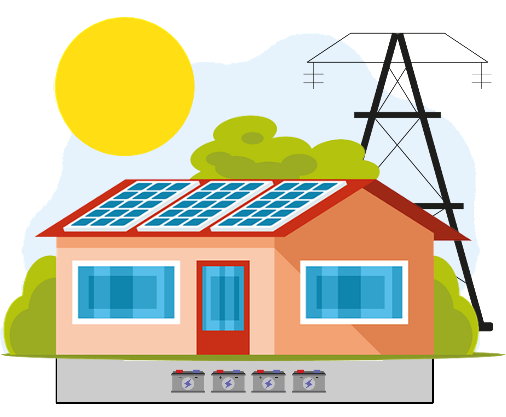

# Adversarial attack modeling on energy system design
This is all code to create an adversarial attack on an energy system model. In the configs, settings for the calculation can be made and the program main.py can be used to start the calculation. For later analysis the calculated data is available in source/output. Prerequisite for the execution is the installation of the IBM CPLEX solver.

  

